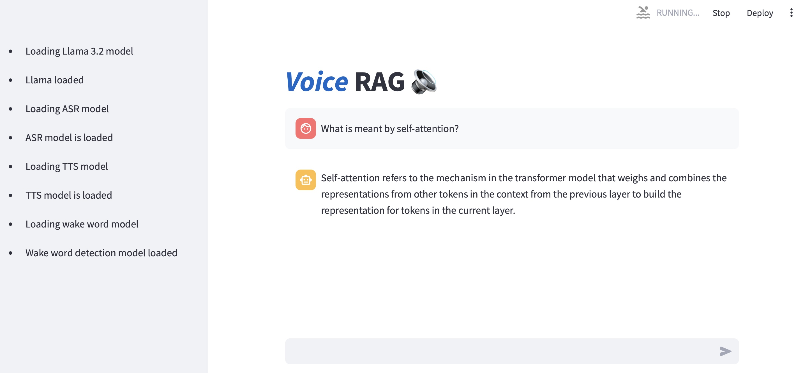
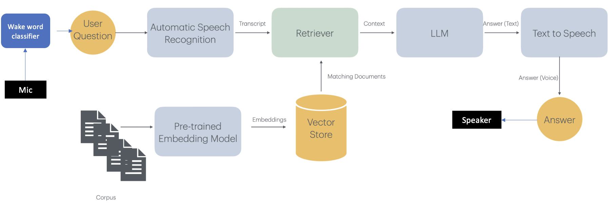

# VRAG (Offline Voice based Retrieval Augmented Generation)

This python web app uses Retrieval Augmented Generation pattern to allow users to query their documents using a voice interface. Users can also select LLM's internal knowledge mode to ask questions without providing additional documentation/context.
Follow the following steps to run the app.

1. Install python version 3.11.9 or greater
2. Create a virtual environment using the following command
   `python -m venv create vrag`
3. Run `source vrag/bin/activate` through macOS/Linux Terminal/shell or run the activate from cmd for Windows to activate the virtual environment
4. Clone this repo using `git clone https://github.com/umairacheema/vrag.git`
5. `cd vrag`
6. Install required libraries using `pip install -r requirements.txt`
7. Install ffmpeg for your operating system
8. Download the required models and config files etc from huggingface in their corresponding subfolders under models folder (Read the README files in each model subfolder for more info)
9. Edit the vrag.yaml file to confirm the path and any other configuration changes (device='mps' if your mac machine has GPU, replace it with 'cpu' or cuda etc for your platform as needed).
10. Copy your PDF documents that you would like to ask questions about in src/documents folder
11. `cd vrag/src`
12. Run `python vectorstore.py` to create vector database. Check if there are files created in src/vectorstore/database after this module exits
13. Run the Web User interface through `streamlit run vrag.py`
14. Now Ask question by Saying the word 'SEVEN' followed by your question.
15. As an example if your PDF documents are about financial metrics and have some information on IRR, the question could be asked by speaking in the mic 'SEVEN what is meant by internal rate of return'.

Following is the architecture of the pipeline

## References ##
1) https://huggingface.co/learn/audio-course/en/chapter7/voice-assistant

2) https://renumics.com/blog/how-to-fine-tune-the-audio-spectrogram-transformer

3) https://huggingface.co/openai/whisper-medium.en/tree/main

4) https://huggingface.co/MIT/ast-finetuned-speech-commands-v2

5) https://huggingface.co/docs/transformers/model_doc/speecht5

6) https://docs.streamlit.io/develop/tutorials/llms/build-conversational-apps#build-a-simple-chatbot-gui-with-streaming
